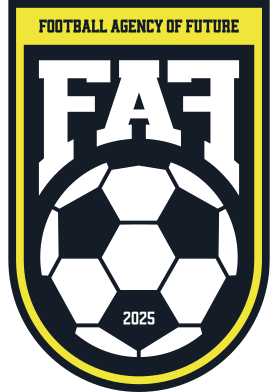

<p align="center">
<a href ="https://f-a-f.ru" target="_blank" title="FAF">

</a>
</p>
<div align="center">

[](https://f-a-f.ru)
[](https://nextjs.org)
[](https://directus.io)
[](https://n8n.io)

</div>

## Introduction

FAF Football Agency stands as an innovative, next-generation website designed for the dynamic football industry landscape. This strategic digital solution creates a vital connection between emerging football talent and premier professional pathways. Engineered with advanced web technologies, the platform provides flawless user interactions across every device while upholding exceptional performance benchmarks.

Developed on Next.js foundation with headless CMS capabilities, the website showcases cutting-edge web development methodologies within the sports domain, harmoniously blending sophisticated aesthetics with robust technical architecture.


# Table of Contents

1. [Features](#features)
2. [Stack](#stack)
3. [Quick Start](#quick-start)
4. [Credits](#credits)

## Features

- ⚽ **Player Database** - Complete football talent profiles and statistics
- 📈 **Industry News** - Current football market updates and agency announcements
- 🏢 **Agency Directory** - Full-scale sports agency information system
- ✍️ **Talent Application** - Digital registration platform for football prospects
- 📲 **Mobile-First Design** - Seamlessly adapted for every screen size
- 🚀 **High-Speed Performance** - Lightning-fast experience powered by Next.js
- 🎯 **Search Engine Ready** - Built for maximum online visibility
- 📊 **Analytics** - Integrated Yandex Metrics for insights

## Stack

- **Frontend:**
  
  
  
  
  
  
  
  
  
  
  
  

- **Backend:**
  
  

- **Tools & Services:**
  
  
  
  
  

## Quick Start

❗ **Prerequisites:**

- ✅ Node.js 18+ installed
- ✅ Directus with tables configured
- ✅ N8N with nodes set up

Clone the repository:

```bash
git clone https://github.com/abrosdaniel/faf-football-agency-site.git
cp .env.example .env
```

Install dependencies:

```bash
npm install
```

Create `.env` in the project root:

```env
NEXT_PUBLIC_FRONT_URL=your_project_url
NEXT_PUBLIC_DIRECTUS_URL=your_directus_url
NEXT_PUBLIC_API_URL=your_n8n_url
NEXT_PUBLIC_YANDEX_METRIKA_ID=your_yandex_metrika_id
NEXT_PUBLIC_YANDEX_CAPTCHA_ID=your_yandex_captcha_id
```

Standard Next.js commands:

```bash
npm run dev
npm run build
npm run start
```

## Credits

- **Developer:** [Daniel Abros](https://abros.dev)
- **Design:** [Daria Afanaseva](https://t.me/a_dari)
- **Client:** [FAF Football Agency](https://f-a-f.ru)
